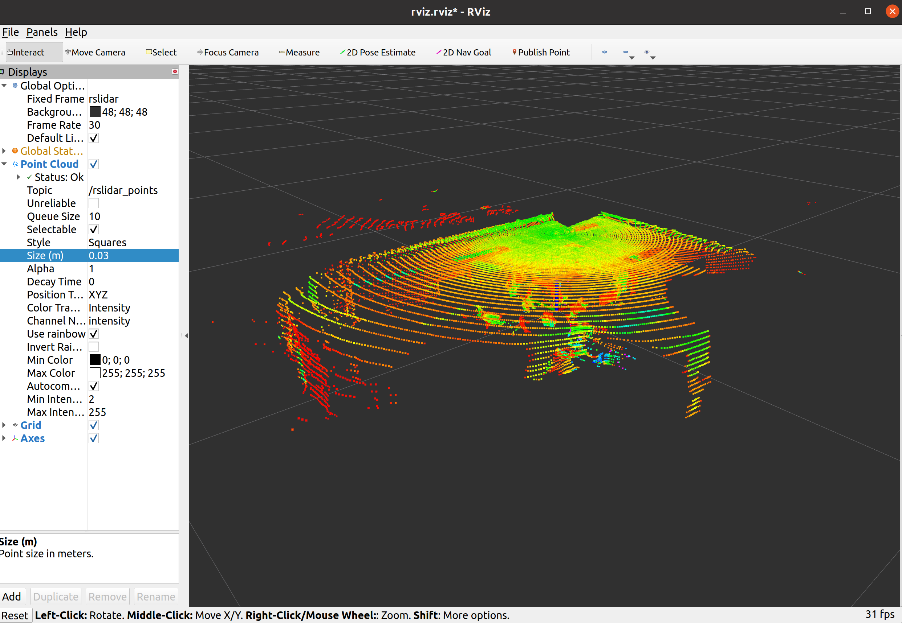

## Dependency

```sh
sudo apt-get update
sudo apt-get install -y libyaml-cpp-dev
sudo apt-get install -y libpcap-dev
```

## How to install

```sh
mkdir -p ~/rslidar_ws/src
cd ~/rslidar_ws/src
git clone https://github.com/RoboSense-LiDAR/rslidar_sdk.git
cd rslidar_sdk
git submodule init
git submodule update
cd ~/rslidar_ws
catkin_make
```

## How to run (Robosense RSAIRY as an example)

```sh
source devel/setup.bash
roslaunch rslidar_sdk start_airy.launch
```

